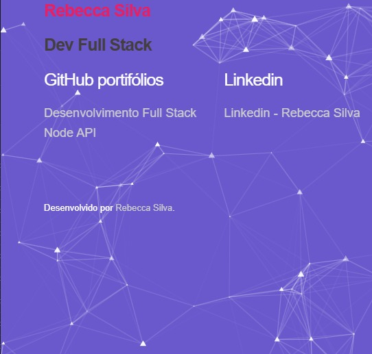

# ✨ Fundo de Partículas

---

## 📌 Sobre o projeto
Este é o meu primeiro projeto utilizando **bibliotecas em nuvem de CSS**.  
Eu nunca havia feito algo assim antes, mas decidi experimentar criando um fundo interativo de **partículas animadas**.  

As partículas se movimentam e, quando você passa o mouse sobre elas, acontece um efeito como se elas **se fechassem ou se conectassem entre si**, gerando uma sensação de movimento fluído e dinâmico. 🎇  

Esse tipo de animação pode ser usado em:
- Portfólios
- Landing pages
- Sites criativos e interativos

---

## 🖼️ Demonstração
A imagem acima (`screenshot.jpg`) mostra uma prévia do resultado.  
Mas você pode **executar o projeto** para ver o efeito real acontecendo em tempo real no navegador.  

---

## 📂 Estrutura dos arquivos
- `index.html` → contém o link da biblioteca em nuvem onde a animação está hospedada.  
- `style.css` → estilização da página.  
- `index.js` → código para controlar o efeito das partículas.  
- `screenshot.jpg` → prévia do projeto em imagem.  

---

## 🔧 Como usar
Você pode:
- Copiar qualquer parte do código que for útil para o seu projeto.  
- Baixar este projeto inteiro e rodar localmente no navegador.  

Basta abrir o arquivo **`index.html`** e já verá o fundo de partículas funcionando ✨  

---

## 💡 Observação
Este projeto foi feito com foco em **estudo e prática**, mas é totalmente reutilizável em outros projetos.  
Fique à vontade para adaptar ou melhorar a ideia! 🚀
